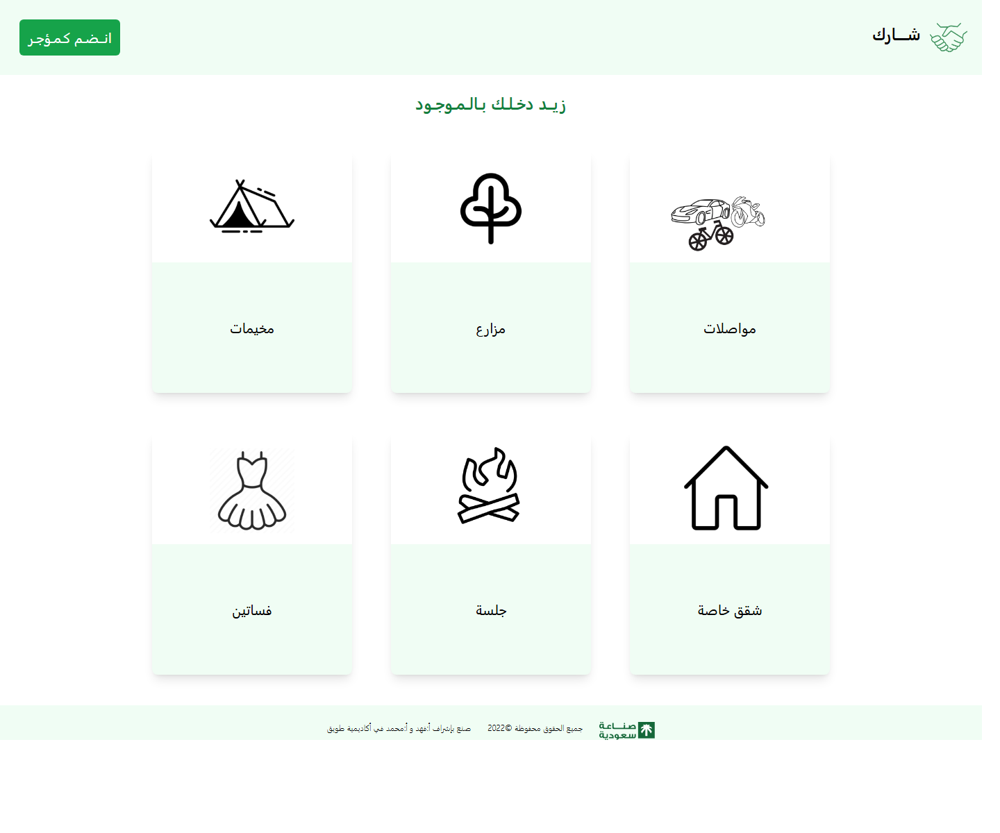
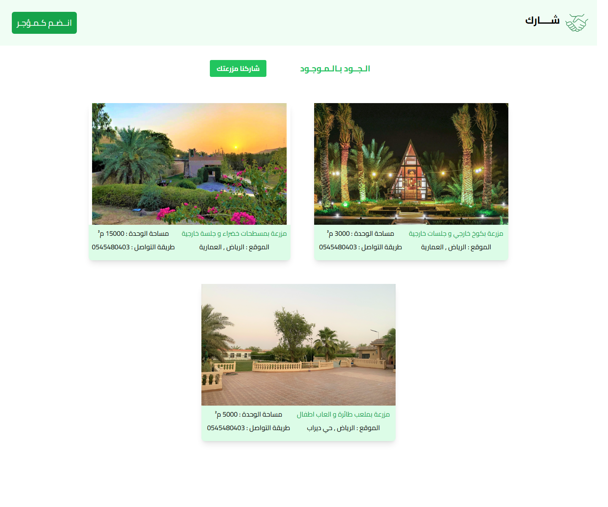

# Sharik — شــــارك

> **زيــد دخـلـك بـالـمـوجـود** — *Increase your income with what you already own.*



*Homepage — category grid*



*Farm category — `/farm` route with sample listings*

## Introduction

**Sharik** (Arabic: شــــارك, "share") is a peer-to-peer rental marketplace with a
fully right-to-left Arabic interface. The idea is simple: people own assets they
don't use every day — a spare car, a farm, a private majlis, event dresses —
and Sharik lets them turn those idle assets into income by renting them out to
others in their community.

The app opens on a visual category grid so users can browse what's available to
rent, and provides a dedicated flow for owners who want to list their own items
("انــضـم كـمـؤجـر" — *Join as a landlord*).

### Categories

| AR | EN | Route |
|---|---|---|
| مواصلات | Transport / cars | `/cars` |
| مزارع | Farms | `/farm` |
| مخيمات | Camps | `/camp` |
| شقق خاصة | Private apartments | `/apartment` |
| جلسة | Majlis / sessions | `/session` |
| فساتين | Dresses | `/dress` |
| — | Landlord signup form | `/form` |

## Features

- Full RTL Arabic UI built with Tailwind utility classes
- Six rental categories, each with its own component and image gallery
- Landlord onboarding form at `/form`
- Responsive card grid with hover animations (`hover:scale-110`, colored
  hover tints per category)
- Client-side routing via Angular Router (unknown paths redirect home)

## Tech stack

- **Angular** 14.0.6
- **Tailwind CSS** 3.1.8
- **TypeScript** 4.7
- **RxJS** 7.5
- Karma + Jasmine for unit tests

## Project structure

```
SharikProject/
├── README.md
├── docs/
│   └── screenshot.png
└── Angular+Tailwind project/
    └── SharikProject/
        ├── angular.json
        ├── tailwind.config.js
        ├── package.json
        └── src/
            ├── index.html
            ├── main.ts
            ├── assets/              # category images, logos
            └── app/
                ├── app.component.*   # nav + router-outlet + footer
                ├── app-routing.module.ts
                ├── header/           # homepage (category grid)
                ├── cars/
                ├── farm/
                ├── camp/
                ├── apartment/
                ├── session/
                ├── dress/
                └── form/             # join-as-landlord form
```

## Getting started

```bash
# 1. Clone
git clone https://github.com/RawanAlghamdi6/SharikProject.git
cd "SharikProject/Angular+Tailwind project/SharikProject"

# 2. Install dependencies
npm install

# 3. Run the dev server
npm start
# or: ng serve

# 4. Open http://localhost:4200
```

### Available scripts

| Command | What it does |
|---|---|
| `npm start` / `ng serve` | Dev server on `http://localhost:4200` with hot reload |
| `npm run build` / `ng build` | Production build into `dist/` |
| `npm run watch` | Development build in watch mode |
| `npm test` / `ng test` | Run unit tests via Karma |

## Credits

Built at **Tuwaiq Academy** (أكاديمية طويق) under the supervision of
أ. فهد and أ. محمد.

© 2022
